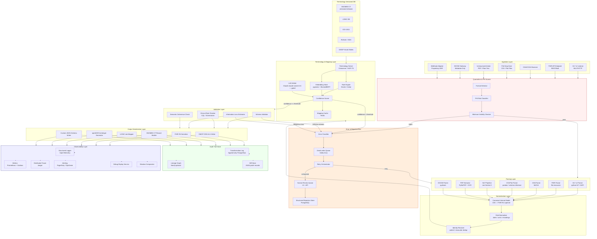

# Universal Healthcare Data Translation Platform
## Technical Specification v1.0

---

## Section 1 — Architecture Overview



---

## Section 2 — Layer-by-Layer Breakdown

### 2.1 Ingestion Layer

**Responsibilities:** Accept data from all source types, perform transport-level acknowledgment, buffer for downstream processing, and assign a globally unique `ingestion_id` before any parsing occurs.

**Technology Choices:**

| Component | Technology | Justification |
|---|---|---|
| Message broker | Apache Kafka | Durable, replayable, horizontally scalable; critical for audit replay |
| HL7 v2 MLLP | Mirth Connect or custom Python MLLP server | Industry-standard for HL7 v2 TCP transport; MLLP ACK/NAK handling is non-trivial |
| FHIR REST endpoint | HAPI FHIR Server (Java) or Firely Server (.NET) | Full R4 conformance, $everything operation, Bulk Data Access support |
| File ingestion | Apache Camel + S3-compatible blob store (MinIO/S3) | Handles polling, FTP, SFTP, FTPS, SCP, local drop directories |
| Unstructured text | Multipart HTTP endpoint + Kafka producer | Streaming upload support for large PDFs |

**Key Design Decisions:**

- Every message written to Kafka before any processing. Ingestion layer produces no transformations — its only job is durable receipt and routing.
- Kafka topics partitioned by `source_system_id` to preserve per-source ordering.
- HL7 v2 MLLP server sends ACK immediately upon Kafka write confirmation, not upon successful transformation. This decouples source system availability from pipeline latency.
- File drop zones use object storage versioning so original bytes are always recoverable.

**Failure Modes:**

| Failure | Response |
|---|---|
| Kafka unavailable | MLLP NAK returned; FHIR/HTTP 503 returned; file remains in drop zone with exponential backoff retry |
| Malformed MLLP framing | Parser pre-check on byte framing; record quarantined with `INGEST_MALFORMED_TRANSPORT` |
| File too large (>500 MB) | Rejected with `INGEST_OVERSIZED`; routed to manual chunking queue |
| Duplicate ingestion (same hash) | Idempotency check against ingestion log; duplicate suppressed, original `ingestion_id` returned |
| Source system sends data faster than consumer capacity | Kafka backpressure; consumer lag monitored; alert at >10k message lag |

---

### 2.2 Parsing Layer

**Responsibilities:** Transform raw bytes into a validated, typed, in-memory intermediate representation. The parser must never produce silent partial outputs — if it cannot produce a minimum viable clinical record (see definition below), it must halt and emit a structured error.

**Minimum Viable Clinical Record (MVCR) definition:** At minimum one of: patient identity anchor (MRN, SSN-hash, name+DOB+gender combination), encounter date, or a clinical code. A record missing all three cannot be usefully mapped and must be rejected as `PARSE_NO_CLINICAL_ANCHOR`.

**Technology Choices:**

| Input Type | Parser | Notes |
|---|---|---|
| HL7 v2 | `python-hl7` + custom segment handler registry | Handles v2.1–v2.8; segment handler registered per message type (ADT, ORU, ORM, MDM) |
| FHIR JSON/XML | `fhir.resources` (Python) or HAPI FHIR | Full R4 profile validation on parse |
| CDA/CCDA | `libCDA` + custom XPath extractors | Section-level extraction with template OID registry |
| CSV/Flat | Schema inference engine + pandas; fallback to probabilistic column mapper | Column headers normalized before mapping |
| Plain text | NLP pipeline (Section 5) | |
| PDF | PyMuPDF for digital PDFs; Tesseract + LayoutParser for scanned | Two-pass: digital extraction first, OCR fallback |
| DICOM | pydicom; metadata only — pixel data never ingested | Tag whitelist enforced |
| Proprietary EHR flat | Plugin adapter system; adapters ship as versioned Docker images | |

**Key Design Decisions:**

- Parsers are stateless, containerized, and individually versioned. A parser version is recorded in every audit record.
- HL7 v2 parser handles Z-segments by logging them as `PARSE_UNKNOWN_SEGMENT` warnings, not errors, to preserve throughput from legacy systems that add custom Z-segments.
- CDA parsing uses a two-layer approach: structural parsing of XML, then semantic extraction of each CDA section by LOINC section code (e.g., `11450-4` for Problem List).
- CSV parser applies probabilistic column classification (trained on EHR column name patterns) but requires human confirmation before promoting a new column mapping to production.

**Failure Modes:**

| Failure | Response |
|---|---|
| Encoding not UTF-8 or Latin-1 | Chardet-based detection; if confidence <0.7, halt with `PARSE_ENCODING_AMBIGUOUS` |
| Missing required HL7 segments (MSH, PID) | Halt with `PARSE_REQUIRED_SEGMENT_MISSING` |
| FHIR resource fails profile validation | Log profile violations; if mandatory elements missing, halt; if optional, flag as `PARSE_PROFILE_DEVIATION` |
| PDF is password-protected | Halt with `PARSE_ENCRYPTED_DOCUMENT`; route to credential management queue |
| OCR confidence <60% over majority of page | Flag `PARSE_LOW_OCR_CONFIDENCE`; human review required before NLP |
| DICOM file contains pixel data | Strip pixel data; log `PARSE_DICOM_PIXEL_STRIPPED` |
| XML/JSON structurally invalid | Halt with `PARSE_INVALID_SYNTAX`; include byte offset of first error |

---

### 2.3 Normalization Layer

**Responsibilities:** Convert all parsed intermediate representations into the Canonical Internal Model (CIM), a FHIR R4 superset that adds provenance fields, confidence scores, and NLP extraction metadata. Resolve dates to UTC ISO 8601, normalize units to UCUM, and resolve patient/encounter identity.

**Canonical Internal Model rationale:** Using FHIR R4 as the base CIM means the normalization-to-output-serialization path for FHIR R4 targets is lossless by construction. For OMOP, openEHR, and SNOMED targets, the CIM provides a rich enough representation that every required field has a defined source.

**Key Design Decisions:**

- **Date normalization:** All dates normalized to UTC. Ambiguous two-digit years resolved by convention (00–29 = 2000–2029; 30–99 = 1930–1999). Ambiguity flagged as `NORM_DATE_AMBIGUOUS_YEAR`.
- **Unit normalization:** UCUM enforced. Free-text units ("mg/dl", "mg/dL", "milligrams per deciliter") resolved via a UCUM synonym table. Unresolvable units flagged.
- **Identity resolution:** Deterministic matching on MRN+source_system first, then probabilistic matching on name+DOB+gender+zip using a Fellegi-Sunter model (via Splink). Matches below 0.95 probability require human confirmation before merge.
- **Conflict resolution:** When two source fields map to the same CIM field with different values (e.g., two different recorded weights), both are preserved in a `ConflictedValue` wrapper with provenance. Downstream mapping layer resolves or escalates.

**Failure Modes:**

| Failure | Response |
|---|---|
| Two records match same patient with low confidence | Flag `NORM_IDENTITY_AMBIGUOUS`; records processed independently, not merged |
| Unit conversion produces physiologically implausible value | Flag `NORM_IMPLAUSIBLE_VALUE` (e.g., temperature 450°F); do not auto-correct |
| Field truncation required for target schema length | Log `NORM_FIELD_TRUNCATED` with original value preserved in audit |

---

### 2.4 Terminology & Mapping Layer

**Responsibilities:** Map CIM concepts to target terminology codes (SNOMED CT, LOINC, ICD-10, RxNorm, OMOP concept IDs). Assign a confidence score to every mapping. Route low-confidence mappings to human review.

**Mapping Approach — Rule-Based vs. Embedding vs. LLM:**

This is the most clinically consequential design decision in the platform. The wrong mapping (e.g., SNOMED 73211009 vs. 44054006) can affect clinical decision support, reimbursement, and research validity. The approach must be a **three-tier hybrid**:

**Tier 1 — Deterministic Rule Engine (confidence: 1.0)**
For all inputs that are already coded (e.g., an HL7 v2 message with an explicit SNOMED code, or a FHIR Coding element), use a curated cross-mapping table maintained by the terminology server. SNOMED → OMOP concept ID mappings come from the official OMOP vocabulary. LOINC → FHIR mappings come from the FHIR LOINC mapping resource. These produce confidence = 1.0 and require no human review unless the source code is deprecated.

**Tier 2 — Vector Embedding Similarity (confidence: 0.7–0.99)**
For free-text clinical concepts extracted by NLP, embed the concept using BiomedBERT (domain-tuned on PubMed/MIMIC), query pgvector for nearest neighbors in the SNOMED/LOINC/OMOP embedding index. Return top-3 candidates with cosine similarity scores. This is appropriate for high-volume, lower-stakes concepts (e.g., lab test names, vital sign labels) where the embedding space is well-populated.

**Tier 3 — LLM Arbitration (confidence: 0.50–0.85, requires human confirmation before promotion)**
Used only when Tier 1 fails (no deterministic mapping) and Tier 2 top-1 confidence < 0.85, OR when the clinical concept is high-stakes (medications, allergies, diagnoses). The LLM (Claude claude-sonnet-4-6 via API, with structured output) receives: the source text, top-3 Tier 2 candidates with their definitions, and is asked to select the best match with reasoning. The LLM output is logged verbatim in the audit trail. LLM-arbitrated mappings **never auto-promote** — they are flagged `MAPPING_LLM_ARBITRATED` and queued for clinical informaticist review before use in production.

**Confidence Threshold — Proposed Default: 0.85**

Clinical reasoning: A mapping at 0.85 confidence means roughly a 1-in-7 chance of being wrong. For a high-volume pipeline processing 1 million records/day, that is ~142,000 potential wrong mappings per day if auto-promoted. This is clinically unacceptable for diagnoses, medications, and allergies. The 0.85 threshold ensures that Tier 2 mappings only auto-promote when the embedding similarity is strong. Below 0.85, the record is flagged and routed. This threshold should be configurable per concept domain: lower (0.75) for administrative codes like visit type, higher (0.95) for medications and allergies.

**Configurable thresholds by domain:**

| Domain | Auto-promote threshold | Halt threshold |
|---|---|---|
| Diagnosis (SNOMED/ICD) | 0.92 | 0.70 |
| Medication / RxNorm | 0.95 | 0.80 |
| Allergy | 0.95 | 0.80 |
| Lab test (LOINC) | 0.85 | 0.65 |
| Vital signs | 0.80 | 0.60 |
| Administrative / visit type | 0.75 | 0.55 |

**Failure Modes:**

| Failure | Response |
|---|---|
| Source code deprecated in current terminology version | Flag `MAPPING_DEPRECATED_CODE`; attempt forward mapping via terminology server history |
| No Tier 1 mapping and Tier 2 top score <0.55 | Halt with `MAPPING_NO_VIABLE_CANDIDATE`; route to human review |
| Terminology server unreachable, no cache hit | Halt with `MAPPING_TERMINOLOGY_SERVER_UNAVAILABLE`; do not proceed with stale cache beyond TTL |
| Two CIM fields collide into one target field with different values | Preserve both in `ambiguous_mapping` array; flag `MAPPING_FIELD_COLLISION` |
| Mapping rule produces clinically dangerous result (detected by post-mapping clinical rule) | Halt with `MAPPING_CLINICAL_SAFETY_VIOLATION`; escalate immediately |
| LLM API unavailable | Fall back to Tier 2 top-1 with `MAPPING_LLM_UNAVAILABLE` flag; if Tier 2 score < domain threshold, halt |

---

### 2.5 Validation Layer

**Responsibilities:** Validate the mapped output against the target schema, apply clinical business rules, estimate information loss, and perform semantic coherence checks.

**Technology Choices:**

- **Schema validation:** JSON Schema (for FHIR, OMOP JSON output), SQL constraint checks (for OMOP relational), Schematron (for CDA output)
- **Clinical rules:** HL7 CQL (Clinical Quality Language) engine for cross-field clinical logic (e.g., medication dosage within physiological range, allergy-medication conflict detection)
- **Information loss estimation:** Pre-computed field coverage matrix per source-target pair; calculated at record level with a `coverage_score` (0–1) and a `lossy_fields` list

**Key Design Decisions:**

- Validation is **always performed** — it cannot be bypassed by configuration.
- A record failing schema validation is never written to output storage.
- Information loss estimation is shown to the user **before** they commit to a target format (via the format selector API endpoint), not only after conversion.
- Semantic coherence checks include: patient age consistent with diagnoses, medication dosage within physiological bounds, and encounter date before death date.

**Failure Modes:**

| Failure | Response |
|---|---|
| Mandatory target field has no source equivalent | Halt with `VALID_REQUIRED_FIELD_UNMAPPABLE` |
| Allergy severity stripped by target schema | Halt with `VALID_CLINICAL_LOSS_ALLERGY_SEVERITY` |
| Medication dosage not representable in target | Halt with `VALID_CLINICAL_LOSS_MEDICATION_DOSAGE` |
| Output fails Schematron/JSON Schema | Halt with `VALID_SCHEMA_VIOLATION` including failing path |

---

### 2.6 Output Serialization Layer

**Responsibilities:** Serialize the validated, mapped CIM representation into the user-selected target format. Write to output store and trigger delivery webhook or polling endpoint.

**Target Format Writers:**

| Target | Implementation |
|---|---|
| OMOP CDM v5.4 | Direct SQL INSERT via SQLAlchemy targeting PostgreSQL; OMOP vocabulary tables required in same DB |
| FHIR R4 | `fhir.resources` serializer; supports JSON and XML; validates against HL7 published profiles |
| SNOMED CT records | Custom serializer producing `{ concept_id, term, fsn, module_id, effective_time, active }` + relationship graph |
| LOINC lab results | LOINC FHIR Observation profile writer |
| openEHR archetypes | ADL2 / openEHR REST API writer; archetype resolved from CKM by clinical concept |
| Custom flat JSON | User-supplied JSON Schema used as template; Jinja2-based field mapping |

**Failure Modes:**

| Failure | Response |
|---|---|
| Output DB unavailable | Buffer serialized output in Kafka; retry with exponential backoff |
| Custom JSON schema field references undefined CIM path | Halt with `OUTPUT_UNDEFINED_MAPPING_PATH` |
| openEHR archetype not found in CKM | Flag `OUTPUT_ARCHETYPE_NOT_FOUND`; propose nearest archetype |

---

### 2.7 Error Handling Layer

See Section 7 for full taxonomy. The error layer is a first-class architectural component, not an afterthought. It includes:

- **Error classifier:** Categorizes every error by layer, type, severity, and recoverability
- **Kafka DLQ:** All unrecoverable errors written to a dedicated dead-letter topic with full payload
- **Human review queue:** Web UI + REST API for clinical informaticists to review, annotate, and resubmit records
- **Retry orchestrator:** Manages retry schedules with jitter; tracks retry count per `ingestion_id`

---

### 2.8 Observability Layer

See Section 8 for full debugging specification. Core components:

- **OpenTelemetry SDK** instrumented in every service; traces span the full ingestion-to-output path
- **Prometheus metrics** exposed per service; scraped into Grafana dashboards
- **Jaeger** for distributed trace visualization
- **Structured JSON logs** with mandatory correlation fields (Section 8)
- **Debug Replay Service:** Accepts any `ingestion_id`, retrieves original bytes from Kafka/object store, reprocesses with step-by-step trace

---

## Section 3 — Audit Trail Data Model

Every transformation step produces one or more `AuditEvent` records. The audit store is append-only. Records are never deleted or updated.

### 3.1 Core Schema (PostgreSQL + JSONB)

```sql
-- Core audit event table
CREATE TABLE audit_event (
    audit_event_id      UUID PRIMARY KEY DEFAULT gen_random_uuid(),
    ingestion_id        UUID NOT NULL,
    session_id          UUID NOT NULL,
    record_id           UUID,
    event_type          TEXT NOT NULL,
    layer               TEXT NOT NULL,
    pipeline_version    TEXT NOT NULL,
    parser_version      TEXT,
    mapper_version      TEXT,
    terminology_version JSONB,
    operator_id         TEXT,
    operator_type       TEXT,
    source_system_id    TEXT NOT NULL,
    source_format       TEXT NOT NULL,
    target_format       TEXT,
    created_at          TIMESTAMPTZ NOT NULL DEFAULT NOW(),
    CONSTRAINT audit_event_layer_check CHECK (layer IN (
        'ingestion','parsing','normalization','mapping','validation','output','error'
    ))
);

-- Field-level transformation record
CREATE TABLE audit_field_transform (
    transform_id        UUID PRIMARY KEY DEFAULT gen_random_uuid(),
    audit_event_id      UUID NOT NULL REFERENCES audit_event(audit_event_id),
    source_path         TEXT NOT NULL,
    source_value        TEXT,
    source_data_type    TEXT,
    target_path         TEXT NOT NULL,
    target_value        TEXT,
    target_data_type    TEXT,
    mapping_method      TEXT NOT NULL,
    mapping_rule_id     TEXT,
    confidence_score    NUMERIC(5,4),
    confidence_method   TEXT,
    flags               TEXT[],
    flag_details        JSONB,
    is_lossy            BOOLEAN NOT NULL DEFAULT FALSE,
    loss_description    TEXT,
    llm_reasoning       TEXT,
    llm_prompt_hash     TEXT,
    reviewer_id         TEXT,
    reviewer_action     TEXT,
    reviewer_note       TEXT,
    reviewed_at         TIMESTAMPTZ,
    CONSTRAINT mapping_method_check CHECK (mapping_method IN (
        'rule_engine','embedding_tier2','llm_tier3','identity','normalization','manual_override'
    ))
);

-- Large value overflow (for source values > 10KB)
CREATE TABLE audit_value_overflow (
    overflow_id         UUID PRIMARY KEY DEFAULT gen_random_uuid(),
    transform_id        UUID NOT NULL REFERENCES audit_field_transform(transform_id),
    field_name          TEXT NOT NULL,
    full_value          TEXT NOT NULL,
    stored_at           TIMESTAMPTZ NOT NULL DEFAULT NOW()
);

-- Rejection record
CREATE TABLE audit_rejection (
    rejection_id        UUID PRIMARY KEY DEFAULT gen_random_uuid(),
    ingestion_id        UUID NOT NULL,
    session_id          UUID NOT NULL,
    error_code          TEXT NOT NULL,
    error_category      TEXT NOT NULL,
    error_layer         TEXT NOT NULL,
    is_retryable        BOOLEAN NOT NULL,
    retry_count         INTEGER NOT NULL DEFAULT 0,
    max_retries         INTEGER NOT NULL,
    diagnostic_payload  JSONB NOT NULL,
    original_bytes_ref  TEXT,
    created_at          TIMESTAMPTZ NOT NULL DEFAULT NOW(),
    resolved_at         TIMESTAMPTZ,
    resolved_by         TEXT,
    resolution_action   TEXT
);

-- Indexes
CREATE INDEX idx_audit_event_ingestion_id ON audit_event(ingestion_id);
CREATE INDEX idx_audit_event_session_id ON audit_event(session_id);
CREATE INDEX idx_audit_event_created_at ON audit_event(created_at);
CREATE INDEX idx_audit_field_transform_flags ON audit_field_transform USING GIN(flags);
CREATE INDEX idx_audit_rejection_error_code ON audit_rejection(error_code);
CREATE INDEX idx_audit_rejection_created_at ON audit_rejection(created_at);
```

### 3.2 Audit Event Types (enum)

```
INGEST_RECEIVED
INGEST_QUARANTINE_PASS
INGEST_QUARANTINE_FAIL
PARSE_STARTED
PARSE_COMPLETED
PARSE_PARTIAL_WARNING
PARSE_FAILED
NORM_STARTED
NORM_COMPLETED
NORM_CONFLICT_FLAGGED
MAPPING_STARTED
MAPPING_TIER1_HIT
MAPPING_TIER2_HIT
MAPPING_TIER3_LLM_INVOKED
MAPPING_BELOW_THRESHOLD
MAPPING_COMPLETED
VALID_STARTED
VALID_PASSED
VALID_FAILED
OUTPUT_STARTED
OUTPUT_COMPLETED
OUTPUT_FAILED
ERROR_CLASSIFIED
HUMAN_REVIEW_QUEUED
HUMAN_REVIEW_RESOLVED
RECORD_REPROCESSED
SHADOW_COMPARISON_COMPLETED
```

### 3.3 Example Audit Record (JSON)

```json
{
  "audit_event": {
    "audit_event_id": "a1b2c3d4-...",
    "ingestion_id": "f7e8d9a0-...",
    "session_id": "c3d4e5f6-...",
    "event_type": "MAPPING_TIER2_HIT",
    "layer": "mapping",
    "pipeline_version": "2.3.1",
    "mapper_version": "1.4.0",
    "terminology_version": { "SNOMED": "2025-09-01", "LOINC": "2.79" },
    "operator_id": "svc-mapping-worker-03",
    "operator_type": "system",
    "source_system_id": "epic_prod_east",
    "source_format": "plain_text",
    "target_format": "omop",
    "created_at": "2026-03-11T14:23:01.234Z"
  },
  "transforms": [
    {
      "transform_id": "b2c3d4e5-...",
      "source_path": "$.nlp_entities[2].text",
      "source_value": "type 2 diabetes mellitus",
      "target_path": "$.condition_occurrence.condition_concept_id",
      "target_value": "44054006",
      "mapping_method": "embedding_tier2",
      "confidence_score": 0.9312,
      "confidence_method": "cosine_similarity",
      "flags": [],
      "is_lossy": false
    }
  ]
}
```

---

## Section 4 — API Contract

### 4.1 REST API

**Base URL:** `https://api.healthtranslate.internal/v1`

**Authentication:** OAuth 2.0 client credentials; all endpoints require `Authorization: Bearer <token>` and a `X-Tenant-Id` header.

---

#### `POST /conversions`

**Request:**
```json
{
  "source_format": "hl7v2",
  "target_format": "omop",
  "delivery_mode": "async",
  "callback_url": "https://client.example.com/webhooks/convert",
  "source_system_id": "epic_prod_east",
  "payload": {
    "encoding": "base64",
    "content_type": "application/hl7-v2",
    "data": "<base64-encoded HL7 v2 message>"
  },
  "options": {
    "confidence_threshold_override": null,
    "allow_lossy_mapping": false,
    "debug_mode": false,
    "dry_run": false
  }
}
```

**Response (202 Accepted — async):**
```json
{
  "ingestion_id": "f7e8d9a0-0001-4b2c-a3d4-e5f678901234",
  "session_id": "c3d4e5f6-0001-4b2c-a3d4-e5f678901234",
  "status": "queued",
  "estimated_completion_ms": 1500,
  "status_url": "/v1/conversions/f7e8d9a0-.../status",
  "audit_url": "/v1/conversions/f7e8d9a0-.../audit"
}
```

---

#### `GET /conversions/{ingestion_id}/status`

**Response:**
```json
{
  "ingestion_id": "f7e8d9a0-...",
  "status": "completed | queued | processing | failed | human_review_required",
  "current_layer": "mapping",
  "progress_pct": 72,
  "created_at": "2026-03-11T14:23:00Z",
  "completed_at": "2026-03-11T14:23:02Z",
  "output_url": "/v1/conversions/.../output",
  "error": null
}
```

---

#### `GET /conversions/{ingestion_id}/audit`

**Response:**
```json
{
  "ingestion_id": "...",
  "events": ["...array of audit_event records..."],
  "transforms": ["...array of audit_field_transform records..."],
  "rejection": null
}
```

---

#### `POST /conversions/{ingestion_id}/replay`

**Request:**
```json
{
  "debug_mode": true,
  "override_options": {
    "force_parser_version": "1.2.0",
    "force_mapper_version": "1.3.0"
  }
}
```

---

#### `GET /format-preview`

**Request:**
```json
{
  "source_format": "cda",
  "target_format": "omop",
  "sample_payload_ref": "f7e8d9a0-..."
}
```

**Response:**
```json
{
  "estimated_coverage_score": 0.87,
  "lossy_fields": [
    {
      "source_path": "$.section[@code='11450-4'].entry.observation.value.physicalExamNarrative",
      "reason": "OMOP CDM has no equivalent free-text exam narrative field",
      "severity": "low_stakes"
    },
    {
      "source_path": "$.section[@code='48765-2'].entry.act.entryRelationship.observation.value.allergyReactionSeverity",
      "reason": "OMOP drug_era does not capture allergy reaction severity",
      "severity": "high_stakes",
      "stop_condition": true
    }
  ],
  "unmappable_fields": 3,
  "high_stakes_loss": true,
  "recommendation": "halt — high-stakes information loss detected; consider FHIR R4 as target or enable extension mechanism"
}
```

---

#### Error Response Schema

```json
{
  "error": {
    "code": "MAPPING_NO_VIABLE_CANDIDATE",
    "category": "mapping",
    "layer": "mapping",
    "http_status": 422,
    "message": "No mapping candidate met the confidence threshold for concept 'periventricular leukomalacia' (NLP confidence: 0.61, threshold: 0.92 for diagnosis domain). Top candidates: SNOMED 413481007 (score: 0.61), SNOMED 230745008 (score: 0.58).",
    "is_retryable": false,
    "requires_human_review": true,
    "ingestion_id": "f7e8d9a0-...",
    "session_id": "c3d4e5f6-...",
    "layer_context": {
      "parser_version": "1.2.1",
      "mapper_version": "1.4.0",
      "terminology_version": { "SNOMED": "2025-09-01" },
      "source_path": "$.nlp_entities[7].text",
      "source_value": "periventricular leukomalacia",
      "candidates": [
        { "code": "413481007", "display": "Periventricular leucomalacia", "score": 0.61 },
        { "code": "230745008", "display": "Periventricular leukomalacia of newborn", "score": 0.58 }
      ]
    },
    "review_queue_url": "/v1/review-queue/items/abc123",
    "documentation_url": "https://docs.healthtranslate.internal/errors/MAPPING_NO_VIABLE_CANDIDATE"
  }
}
```

---

### 4.2 Event-Driven API (Kafka)

**Topics:**

| Topic | Direction | Format | Purpose |
|---|---|---|---|
| `ht.ingest.raw.{format}` | Inbound | Avro | Raw submitted records per format |
| `ht.parse.completed` | Internal | Avro | Parsed CIM records |
| `ht.mapping.completed` | Internal | Avro | Mapped records ready for validation |
| `ht.output.completed` | Outbound | Avro | Successfully converted records |
| `ht.errors.classified` | Internal | Avro | All classified errors |
| `ht.dlq.{layer}` | DLQ | JSON | Dead letter records per layer |
| `ht.review.queued` | Outbound | Avro | Records routed to human review |
| `ht.shadow.comparison` | Internal | Avro | Shadow mode comparison results |

**Event envelope (Avro):**
```json
{
  "type": "record",
  "name": "HTPipelineEvent",
  "fields": [
    { "name": "event_id", "type": "string" },
    { "name": "ingestion_id", "type": "string" },
    { "name": "session_id", "type": "string" },
    { "name": "event_type", "type": "string" },
    { "name": "pipeline_version", "type": "string" },
    { "name": "created_at", "type": { "type": "long", "logicalType": "timestamp-millis" } },
    { "name": "payload", "type": "bytes" },
    { "name": "payload_schema_version", "type": "string" },
    { "name": "trace_context", "type": {
        "type": "record",
        "name": "TraceContext",
        "fields": [
          { "name": "trace_id", "type": "string" },
          { "name": "span_id", "type": "string" },
          { "name": "parent_span_id", "type": ["null", "string"] }
        ]
      }
    }
  ]
}
```

---

## Section 5 — NLP Pipeline Design

### 5.1 Architecture

```
Raw Text
    │
    ▼
[Pre-processor]
 - Encoding normalization
 - Sentence boundary detection (ScispaCy)
 - Section header detection (regex + CRF model trained on MIMIC-III section headers)
 - Boilerplate removal (template detection)
    │
    ▼
[Entity Recognition] — multi-model ensemble
 - Primary: ScispaCy en_core_sci_lg
 - Secondary: AWS Comprehend Medical or Google Healthcare NLP API
 - Tertiary: Custom fine-tuned BioBERT on MIMIC discharge summaries
 - Voting: majority vote on entity boundaries; confidence = mean of agreeing models
    │
    ▼
[Negation & Assertion Detection]
 - NegEx algorithm extended with ScispaCy negation component
 - Assertion classes: ASSERTED | NEGATED | POSSIBLE | FAMILY_HISTORY | HISTORICAL | HYPOTHETICAL
    │
    ▼
[Temporal Reasoning]
 - Rule-based date anchor extraction (absolute and relative dates)
 - HeidelTime for temporal expression normalization
 - If document_date missing: flag TEMPORAL_ANCHOR_MISSING
    │
    ▼
[Relation Extraction]
 - Medication-dosage-route-frequency (custom BioBERT fine-tuned on n2c2 datasets)
 - Problem-procedure-finding relations
 - Family history relations
    │
    ▼
[Confidence Scoring & Candidate Generation]
 - Each entity: { text, start_char, end_char, entity_type, assertion_class,
                  assertion_confidence, temporal_expression, candidates[] }
 - candidates[]: top-3 terminology matches from Tier 2 embedding search
    │
    ▼
[Output: Structured NLP Result]
```

### 5.2 Entity Output Schema

```json
{
  "nlp_result_id": "uuid",
  "document_id": "ingestion_id",
  "nlp_pipeline_version": "3.1.0",
  "models_used": ["scispacy_en_core_sci_lg_3.7.0", "comprehend_medical_v2", "bioBERT_MIMIC_ft_1.2"],
  "entities": [
    {
      "entity_id": "e_001",
      "text": "type 2 diabetes mellitus",
      "start_char": 142,
      "end_char": 166,
      "entity_type": "DIAGNOSIS",
      "assertion_class": "ASSERTED",
      "assertion_confidence": 0.97,
      "temporal_expression": null,
      "section": "ASSESSMENT_AND_PLAN",
      "candidates": [
        { "terminology": "SNOMED", "code": "44054006", "display": "Diabetes mellitus type 2", "confidence": 0.9312 },
        { "terminology": "SNOMED", "code": "73211009", "display": "Diabetes mellitus", "confidence": 0.7841 },
        { "terminology": "ICD10CM", "code": "E11", "display": "Type 2 diabetes mellitus", "confidence": 0.9105 }
      ],
      "auto_map_candidate": { "terminology": "SNOMED", "code": "44054006", "confidence": 0.9312 },
      "ambiguous": false,
      "model_agreement": { "scispacy": "44054006", "comprehend_medical": "44054006", "bioBERT": "44054006", "agreement_score": 1.0 }
    },
    {
      "entity_id": "e_002",
      "text": "periventricular leukomalacia",
      "entity_type": "DIAGNOSIS",
      "assertion_class": "HISTORICAL",
      "assertion_confidence": 0.88,
      "candidates": [
        { "terminology": "SNOMED", "code": "413481007", "display": "Periventricular leucomalacia", "confidence": 0.61 },
        { "terminology": "SNOMED", "code": "230745008", "display": "Periventricular leukomalacia of newborn", "confidence": 0.58 }
      ],
      "auto_map_candidate": null,
      "ambiguous": true,
      "ambiguity_reason": "Top candidate confidence 0.61 below diagnosis threshold 0.92",
      "flags": ["MAPPING_AMBIGUOUS_CANDIDATE", "NLP_ASSERTION_HISTORICAL"],
      "requires_human_review": true
    }
  ]
}
```

### 5.3 Negation and Assertion Handling

Negated entities are **never silently discarded**. They are preserved with `assertion_class: "NEGATED"` because the presence of a negation is clinically meaningful.

**Assertion class mapping to target formats:**

| Assertion Class | FHIR Encoding | OMOP Encoding |
|---|---|---|
| ASSERTED | verificationStatus: confirmed | condition_type_concept_id: 32020 |
| NEGATED | verificationStatus: refuted | condition_status_concept_id: 4135493 (absent) |
| POSSIBLE | verificationStatus: provisional | condition_status_concept_id: 4197528 (possible) |
| FAMILY_HISTORY | FamilyMemberHistory resource | observation_concept_id (family history) |
| HISTORICAL | clinicalStatus: resolved | condition_status_concept_id: 4230359 (historical) |
| HYPOTHETICAL | Note extension; cannot be losslessly encoded | Flag VALID_ASSERTION_ENCODING_LOSSY |

### 5.4 Low-Confidence Extraction Surfacing

Low-confidence extractions are **never silently resolved**. They are surfaced via:

1. **API response:** `flags` array includes `NLP_LOW_CONFIDENCE_ENTITY`
2. **Human review queue:** Entity added with both candidates displayed side-by-side with clinical definitions
3. **Audit trail:** `confidence_score < threshold` with reason flags
4. **Format preview:** NLP-dependent fields shown as uncertain

---

## Section 6 — Build Specification

### 6.1 Phased Implementation Plan

#### Milestone 0 — Foundation Infrastructure (Weeks 1–4)

**Deliverables:**
- Kubernetes cluster (EKS/GKE) via Terraform
- Kafka cluster with Schema Registry
- PostgreSQL (RDS Aurora) for audit trail
- Object store (S3/MinIO) for raw record archive
- Redis cluster for mapping cache
- Secrets management: AWS Secrets Manager or HashiCorp Vault
- Base Docker images published to ECR
- CI/CD pipeline skeleton
- OpenTelemetry Collector → Jaeger (staging), Tempo (production)
- Prometheus + Grafana with base infrastructure dashboards

**Definition of Done:** All infrastructure pods healthy; Kafka end-to-end test passes; secret read from Vault in pod succeeds; Grafana shows live metrics.

---

Milestone 1 — Ingestion Layer (Weeks 5–8)

  Deliverables:
  - MLLP server for HL7 v2 (containerized, horizontally scalable)
  - FHIR R4 endpoint (HAPI FHIR Server, Helm chart deployed)
  - File drop zone poller (Apache Camel, S3 trigger → Kafka producer)
  - HTTP multipart endpoint for unstructured text and PDF
  - Ingestion ID generation service
  - Format detector service
  - PHI risk classifier (regex + ML model; NER-based PHI detection using Presidio)
  - Minimum viability checker
  - Ingestion metrics: messages/sec per format, lag, error rate
  - Integration tests: each format can be submitted and produces a Kafka message

  Pre-requisites: Milestone 0 complete

  Definition of Done:
  - All 8 input format types ingested successfully in integration test suite
  - PHI classifier correctly flags test records containing SSN, DOB, and name patterns
  - MLLP server handles 10,000 HL7 v2 messages/minute without message loss
  - Dead letter queue populated correctly for malformed inputs

  ---
  Milestone 2 — Parsing Layer (Weeks 9–14)

  Deliverables:
  - Parser per format (HL7 v2, FHIR, CDA, CSV, DICOM) — each as an independent containerized service
  - CIM definition v1.0 (FHIR R4 superset) published as JSON Schema
  - Parser output → CIM serialization for all 8 formats
  - PDF extractor service (PyMuPDF + Tesseract, GPU-enabled node pool for OCR at scale)
  - Parser version registry (each parser image tagged with semver)
  - Unit tests: ≥90% line coverage per parser; synthetic test fixtures for each format
  - Parser error taxonomy implemented (see Section 7)

  Pre-requisites: Milestone 1; CIM schema peer-reviewed by clinical informaticist

  Definition of Done:
  - 50 synthetic test records per format parsed correctly
  - All parser error codes produced and correctly routed to DLQ
  - OCR parser produces MVCR from a scanned synthetic discharge summary

  ---
  Milestone 3 — Normalization Layer (Weeks 15–18)

  Deliverables:
  - Date normalization service (UTC, ambiguous year resolution)
  - Unit normalization service (UCUM, synonym table)
  - Identity resolution service (Splink-based; configured for match threshold 0.95)
  - Conflict detection and ConflictedValue wrapper implementation
  - Normalization audit events wired

  Pre-requisites: Milestone 2

  Definition of Done:
  - 200 synthetic records normalized; zero silent failures
  - Identity resolution correctly matches synthetic duplicates above 0.95 threshold and flags below

  ---
  Milestone 4 — Terminology Infrastructure (Weeks 19–22)

  Deliverables:
  - Terminology server deployed (Ontoserver or HAPI FHIR Terminology Server)
  - SNOMED CT, LOINC, ICD-10-CM, RxNorm, OMOP vocabularies loaded
  - Terminology version database: each release version stored as an immutable snapshot; active version tracked in config
  - pgvector extension deployed; BiomedBERT embedding index built for SNOMED + LOINC
  - Mapping cache (Redis) with TTL management
  - Terminology version migration runbook: during a version update, both old and new versions are simultaneously available; records
  in flight use the version they started with; new records use the new version after cutover; post-migration regression tests run
  automatically
  - SNOMED CT update process: download from NLM, import via Ontoserver API, run embedding reindex job, run regression test suite,
  promote if pass rate ≥99%

  Pre-requisites: Milestone 3; NLM UMLS license; SNOMED CT license

  Definition of Done:
  - SNOMED hierarchy query responds in <100ms for 99th percentile
  - Embedding search returns top-3 candidates in <200ms for 99th percentile
  - Terminology version rollback tested successfully
  - During simulated version update, in-flight records continue to process with old version

  ---
  Milestone 5 — Mapping Layer (Weeks 23–28)

  Deliverables:
  - Tier 1 rule engine (Drools or Python rule DSL) with initial curated cross-mapping tables
  - Tier 2 embedding similarity search integrated
  - Tier 3 LLM arbiter (Claude API) with structured output prompts and prompt hash logging
  - Confidence scorer
  - Domain-specific threshold configuration
  - Mapping version registry (each rule set versioned as a Docker image + artifact)
  - Mapping diff tool (Section 8)
  - Shadow mode infrastructure (Section 8)
  - All mapping error codes implemented

  Pre-requisites: Milestone 4; LLM API key in Vault; clinical informaticist review of initial rule set

  Definition of Done:
  - Golden dataset v1 (100 records, clinically reviewed) mapped with ≥95% accuracy
  - Tier 3 LLM invocations logged verbatim; prompt hash reproducible
  - Shadow mode produces comparison report for 1,000 records in <5 minutes

  ---
  Milestone 6 — Validation and Output Layer (Weeks 29–34)

  Deliverables:
  - Schema validators for all 6 target formats
  - CQL clinical rule engine with initial rule set (allergy severity, medication dosage, date sanity checks)
  - Information loss estimator
  - All 6 output format writers
  - Format preview API endpoint
  - Output storage (format-specific: PostgreSQL for OMOP, FHIR repository for FHIR, S3 for flat files)
  - End-to-end integration tests for all 8 source × 6 target combinations (48 test paths)

  Pre-requisites: Milestone 5

  Definition of Done:
  - All 48 source-target paths pass integration tests with synthetic fixtures
  - Format preview correctly identifies high-stakes information loss in test cases
  - Clinical validation review of 50 OMOP-converted records by clinical informaticist: ≥98% field-level accuracy

  ---
  Milestone 7 — NLP Pipeline (Weeks 35–42)

  Deliverables:
  - ScispaCy + Comprehend Medical + BioBERT ensemble service (GPU node pool)
  - Negation detection (NegEx + ScispaCy)
  - Temporal reasoning (HeidelTime)
  - Relation extraction (medication-dosage-route)
  - NLP confidence scorer and candidate generator
  - Human review UI for ambiguous NLP extractions
  - NLP pipeline versioned; version recorded in every audit event

  Pre-requisites: Milestone 6; GPU node pool provisioned; MIMIC-III access for fine-tuning (or n2c2 datasets)

  Definition of Done:
  - NLP pipeline evaluated on 500 synthetic discharge summary sentences: NER F1 ≥ 0.88, negation accuracy ≥ 0.92
  - Ambiguous extractions routed to human review queue correctly in 100% of test cases

  ---
  Milestone 8 — Error Handling, Debugging, and Observability (Weeks 43–48)

  Deliverables:
  - Full error taxonomy implemented across all layers
  - Dead letter queue strategy fully operational
  - Debug replay service
  - Terminology audit tool
  - Shadow mode UI
  - Mapping diff tool
  - 10-minute bug resolution runbook (Section 8)
  - Grafana dashboards: pipeline throughput, error rates per category, mapping confidence distribution, NLP model agreement rate
  - PagerDuty alert rules for all P1/P2 conditions
  - Runbooks for all alert types

  Pre-requisites: All prior milestones

  Definition of Done:
  - Simulate each of the 30+ error codes; verify correct routing, storage, and alerting
  - Debug replay test: given a failing ingestion_id, a developer can trace root cause in <10 minutes
  - All P1 alerts fire correctly in chaos testing

  ---
  Milestone 9 — Production Hardening and Launch (Weeks 49–56)

  Deliverables:
  - Load test: 1,000,000 records/day sustained throughput validated
  - Penetration test (third-party)
  - HIPAA technical safeguard review
  - Disaster recovery drill: full pipeline recovery from backup in <4 hours
  - Production environment provisioned (separate AWS account / GCP project)
  - Secret rotation automation (Vault dynamic secrets for DB credentials; 24-hour TTL)
  - Gradual rollout plan: 5% → 25% → 100% traffic with automated canary analysis
  - Clinical validation sign-off document from clinical informatics team

  Definition of Done: All production readiness checklist items checked; sign-off from engineering lead, clinical informatics lead,
  and security team.

  ---
  6.2 Containerization Strategy

  - Every service runs as a single-purpose container; no multi-service containers
  - Base images: python:3.12-slim (Python services), eclipse-temurin:21-jre (Java services)
  - All images scanned with Trivy in CI; critical/high CVEs block promotion
  - Images tagged with {service}-{git-sha}-{semver}; latest tag never used in production
  - Distroless images for production; dev images include debugging tools
  - Parser and mapper images versioned independently of platform version to enable independent rollback

  6.3 Environment Management

  ┌─────────────┬──────────────────────────┬────────────────────────────────────────────────┬────────────────────────────────────┐
  │ Environment │         Purpose          │                      Data                      │               Access               │
  ├─────────────┼──────────────────────────┼────────────────────────────────────────────────┼────────────────────────────────────┤
  │ dev         │ Local development        │ Synthetic only; no real PHI                    │ Developer                          │
  ├─────────────┼──────────────────────────┼────────────────────────────────────────────────┼────────────────────────────────────┤
  │ staging     │ Pre-production           │ De-identified copy of prod data, refreshed     │ Engineering + clinical informatics │
  │             │ validation               │ weekly                                         │                                    │
  ├─────────────┼──────────────────────────┼────────────────────────────────────────────────┼────────────────────────────────────┤
  │ production  │ Live clinical data       │ Real PHI; full HIPAA controls                  │ Restricted; break-glass for        │
  │             │                          │                                                │ emergency                          │
  └─────────────┴──────────────────────────┴────────────────────────────────────────────────┴────────────────────────────────────┘

  - Terraform workspaces per environment; separate state files in S3 with DynamoDB lock
  - No manual changes to production infrastructure; all changes via CI/CD with peer review
  - Feature flags (LaunchDarkly or Unleash) control rollout of new parser/mapper versions per environment

  6.4 CI/CD Pipeline

  Push to branch
      │
      ▼
  [Lint + Type Check] — ruff, mypy, eslint
      │
      ▼
  [Unit Tests] — pytest; coverage threshold enforced per service
      │
      ▼
  [Build Docker Image] — multi-stage; layer caching
      │
      ▼
  [Image Scan] — Trivy; block on critical CVEs
      │
      ▼
  [Integration Tests] — docker-compose; synthetic fixtures
      │
      ▼
  [Push to Registry] — only on main branch or release tag
      │
      ▼
  [Deploy to Staging] — Helm upgrade; canary analysis with Argo Rollouts
      │
      ▼
  [Staging Smoke Tests + Regression Tests]
      │
      ▼
  [Manual Approval Gate] — for production deployments
      │
      ▼
  [Deploy to Production] — canary: 5% → 25% → 100% over 2 hours
      │
      ▼
  [Automated Canary Analysis] — error rate, latency, mapping confidence distribution
      │
      ▼
  [Promote or Rollback]

  6.5 Terminology Database Versioning Strategy

  Problem: SNOMED CT releases twice yearly (March and September). OMOP vocabulary releases quarterly. During an update, the system
  must:
  1. Continue processing in-flight records with the old version
  2. Switch to the new version atomically for new records
  3. Flag any records previously mapped with the old version that have affected codes
  4. Provide rollback capability

  Solution:

  terminology_version_registry table:
    - version_id (UUID)
    - terminology_name (SNOMED | LOINC | OMOP | ...)
    - release_date (DATE)
    - import_completed_at (TIMESTAMPTZ)
    - status (importing | testing | active | superseded | rolled_back)
    - activated_at (TIMESTAMPTZ)
    - superseded_at (TIMESTAMPTZ)

  - New version imports into a separate schema/namespace without affecting active version
  - Automated regression test suite runs against new version using golden dataset
  - If regression pass rate ≥99%, version is promoted (status → active); old version → superseded
  - All audit records store terminology_version at time of mapping
  - Post-promotion: terminology audit tool runs a batch job flagging all audit records where the mapped code was deprecated or
  modified in the new version
  - Rollback: flip active pointer back to prior version; no data migration required

  ---
  Section 7 — Error Handling Specification

  7.1 Error Code Convention

  Format: {LAYER}_{TYPE}_{SPECIFICS}

  Examples: INGEST_MALFORMED_TRANSPORT, PARSE_ENCODING_AMBIGUOUS, MAPPING_NO_VIABLE_CANDIDATE

  All error codes are registered in a central error registry (YAML file in the codebase, published to docs). Every error code has:
  layer, type, default severity, default recoverability, documentation URL.

  7.2 Complete Error Taxonomy

  Layer: INGEST

  ┌──────────────────────────────┬───────────────────────────────────────────┬─────────────┬─────────────┬───────────────────────┐
  │             Code             │                Description                │ Recoverable │   Human     │        Action         │
  │                              │                                           │             │  Required   │                       │
  ├──────────────────────────────┼───────────────────────────────────────────┼─────────────┼─────────────┼───────────────────────┤
  │ INGEST_MALFORMED_TRANSPORT   │ MLLP framing invalid or HTTP body         │ No          │ No          │ DLQ; alert ops        │
  │                              │ unreadable                                │             │             │                       │
  ├──────────────────────────────┼───────────────────────────────────────────┼─────────────┼─────────────┼───────────────────────┤
  │ INGEST_OVERSIZED             │ Payload exceeds size limit                │ No          │ Yes         │ Manual chunking queue │
  ├──────────────────────────────┼───────────────────────────────────────────┼─────────────┼─────────────┼───────────────────────┤
  │ INGEST_DUPLICATE             │ Same content hash already ingested        │ N/A         │ No          │ Suppress; return      │
  │                              │                                           │             │             │ original ID           │
  ├──────────────────────────────┼───────────────────────────────────────────┼─────────────┼─────────────┼───────────────────────┤
  │ INGEST_UNKNOWN_FORMAT        │ Format detector cannot classify           │ No          │ Yes         │ Human review          │
  ├──────────────────────────────┼───────────────────────────────────────────┼─────────────┼─────────────┼───────────────────────┤
  │ INGEST_KAFKA_UNAVAILABLE     │ Cannot write to Kafka                     │ Yes         │ No          │ Retry with backoff;   │
  │                              │                                           │             │             │ MLLP NAK              │
  ├──────────────────────────────┼───────────────────────────────────────────┼─────────────┼─────────────┼───────────────────────┤
  │ INGEST_PHI_RISK_UNRESOLVABLE │ PHI detected that cannot be de-identified │ No          │ Yes         │ Stop; HIPAA           │
  │                              │  before processing                        │             │             │ escalation queue      │
  └──────────────────────────────┴───────────────────────────────────────────┴─────────────┴─────────────┴───────────────────────┘

  Layer: PARSE

  ┌────────────────────────────────┬────────────────────────────────────────┬──────────────┬────────────┬───────────────────────┐
  │              Code              │              Description               │ Recoverable  │   Human    │        Action         │
  │                                │                                        │              │  Required  │                       │
  ├────────────────────────────────┼────────────────────────────────────────┼──────────────┼────────────┼───────────────────────┤
  │ PARSE_INVALID_SYNTAX           │ Document structurally invalid          │ No           │ Possible   │ DLQ; include byte     │
  │                                │ (malformed XML, invalid JSON)          │              │            │ offset                │
  ├────────────────────────────────┼────────────────────────────────────────┼──────────────┼────────────┼───────────────────────┤
  │ PARSE_ENCODING_AMBIGUOUS       │ Character encoding cannot be           │ No           │ Yes        │ Human review          │
  │                                │ determined with >70% confidence        │              │            │                       │
  ├────────────────────────────────┼────────────────────────────────────────┼──────────────┼────────────┼───────────────────────┤
  │ PARSE_REQUIRED_SEGMENT_MISSING │ Required HL7 segment (MSH, PID) absent │ No           │ Yes        │ Human review          │
  ├────────────────────────────────┼────────────────────────────────────────┼──────────────┼────────────┼───────────────────────┤
  │ PARSE_NO_CLINICAL_ANCHOR       │ No patient identity, encounter date,   │ No           │ Yes        │ Human review          │
  │                                │ or clinical code found                 │              │            │                       │
  ├────────────────────────────────┼────────────────────────────────────────┼──────────────┼────────────┼───────────────────────┤
  │ PARSE_PROFILE_DEVIATION        │ FHIR profile validation failed on      │ Yes          │ No         │ Flag; continue with   │
  │                                │ optional elements                      │ (degraded)   │            │ available data        │
  ├────────────────────────────────┼────────────────────────────────────────┼──────────────┼────────────┼───────────────────────┤
  │ PARSE_LOW_OCR_CONFIDENCE       │ >50% of OCR output below 60%           │ No           │ Yes        │ Human review          │
  │                                │ confidence                             │              │            │                       │
  ├────────────────────────────────┼────────────────────────────────────────┼──────────────┼────────────┼───────────────────────┤
  │ PARSE_ENCRYPTED_DOCUMENT       │ PDF password-protected                 │ No           │ Yes        │ Credential management │
  │                                │                                        │              │            │  queue                │
  ├────────────────────────────────┼────────────────────────────────────────┼──────────────┼────────────┼───────────────────────┤
  │ PARSE_DICOM_PIXEL_STRIPPED     │ Pixel data removed from DICOM          │ N/A          │ No         │ Info log only         │
  │                                │ (expected behavior)                    │              │            │                       │
  ├────────────────────────────────┼────────────────────────────────────────┼──────────────┼────────────┼───────────────────────┤
  │ PARSE_UNKNOWN_SEGMENT          │ HL7 Z-segment encountered              │ Yes          │ No         │ Log warning; continue │
  ├────────────────────────────────┼────────────────────────────────────────┼──────────────┼────────────┼───────────────────────┤
  │ PARSE_TRUNCATED_FIELD          │ HL7 field exceeds component length     │ Yes          │ No         │ Log; use truncated    │
  │                                │ spec                                   │ (degraded)   │            │ value                 │
  └────────────────────────────────┴────────────────────────────────────────┴──────────────┴────────────┴───────────────────────┘

  Layer: NORM

  ┌──────────────────────────┬────────────────────────────────────┬─────────────────────┬─────────────┬─────────────────────────┐
  │           Code           │            Description             │     Recoverable     │   Human     │         Action          │
  │                          │                                    │                     │  Required   │                         │
  ├──────────────────────────┼────────────────────────────────────┼─────────────────────┼─────────────┼─────────────────────────┤
  │ NORM_DATE_AMBIGUOUS_YEAR │ Two-digit year in ambiguous range  │ Yes (convention     │ No          │ Flag; log convention    │
  │                          │                                    │ applied)            │             │ used                    │
  ├──────────────────────────┼────────────────────────────────────┼─────────────────────┼─────────────┼─────────────────────────┤
  │ NORM_UNIT_UNRESOLVABLE   │ Unit string not mappable to UCUM   │ No                  │ Yes         │ Human review            │
  ├──────────────────────────┼────────────────────────────────────┼─────────────────────┼─────────────┼─────────────────────────┤
  │ NORM_IMPLAUSIBLE_VALUE   │ Numeric value physiologically      │ No                  │ Yes         │ Human review; never     │
  │                          │ implausible                        │                     │             │ auto-correct            │
  ├──────────────────────────┼────────────────────────────────────┼─────────────────────┼─────────────┼─────────────────────────┤
  │ NORM_IDENTITY_AMBIGUOUS  │ Patient match probability <0.95    │ No                  │ Yes         │ Records kept separate;  │
  │                          │                                    │                     │             │ flagged                 │
  ├──────────────────────────┼────────────────────────────────────┼─────────────────────┼─────────────┼─────────────────────────┤
  │ NORM_FIELD_TRUNCATED     │ Field truncated to fit schema      │ Yes                 │ No          │ Original preserved in   │
  │                          │                                    │                     │             │ audit                   │
  ├──────────────────────────┼────────────────────────────────────┼─────────────────────┼─────────────┼─────────────────────────┤
  │ NORM_CONFLICTED_VALUE    │ Two sources produce different      │ Yes (preserved as   │ No          │ Flag; Tier 2 resolution │
  │                          │ values for same field              │ conflict)           │             │                         │
  └──────────────────────────┴────────────────────────────────────┴─────────────────────┴─────────────┴─────────────────────────┘

  Layer: MAPPING

  ┌────────────────────────────────────────┬────────────────────────────┬─────────────────┬──────────────┬──────────────────────┐
  │                  Code                  │        Description         │   Recoverable   │    Human     │        Action        │
  │                                        │                            │                 │   Required   │                      │
  ├────────────────────────────────────────┼────────────────────────────┼─────────────────┼──────────────┼──────────────────────┤
  │                                        │ Source code is deprecated  │ Yes (forward    │ If forward   │ Flag; attempt        │
  │ MAPPING_DEPRECATED_CODE                │ in active terminology      │ map attempted)  │ map fails    │ forward mapping      │
  │                                        │ version                    │                 │              │                      │
  ├────────────────────────────────────────┼────────────────────────────┼─────────────────┼──────────────┼──────────────────────┤
  │ MAPPING_NO_VIABLE_CANDIDATE            │ All candidates below halt  │ No              │ Yes          │ Human review queue   │
  │                                        │ threshold                  │                 │              │                      │
  ├────────────────────────────────────────┼────────────────────────────┼─────────────────┼──────────────┼──────────────────────┤
  │ MAPPING_BELOW_THRESHOLD                │ Top candidate below        │ No              │ Yes          │ Human review queue   │
  │                                        │ auto-promote threshold     │                 │              │                      │
  ├────────────────────────────────────────┼────────────────────────────┼─────────────────┼──────────────┼──────────────────────┤
  │ MAPPING_TERMINOLOGY_SERVER_UNAVAILABLE │ Terminology server         │ No              │ No           │ Halt record; retry   │
  │                                        │ unreachable, cache miss    │                 │              │ queue; alert         │
  ├────────────────────────────────────────┼────────────────────────────┼─────────────────┼──────────────┼──────────────────────┤
  │                                        │ Two CIM fields map to same │                 │              │ Both values          │
  │ MAPPING_FIELD_COLLISION                │  target field with         │ No              │ Yes          │ preserved in audit   │
  │                                        │ different values           │                 │              │                      │
  ├────────────────────────────────────────┼────────────────────────────┼─────────────────┼──────────────┼──────────────────────┤
  │                                        │ Mapping produced by LLM;   │ No (pending     │              │                      │
  │ MAPPING_LLM_ARBITRATED                 │ requires human             │ review)         │ Yes          │ Review queue         │
  │                                        │ confirmation               │                 │              │                      │
  ├────────────────────────────────────────┼────────────────────────────┼─────────────────┼──────────────┼──────────────────────┤
  │ MAPPING_LLM_UNAVAILABLE                │ LLM API unreachable, Tier  │ No              │ Yes          │ Human review         │
  │                                        │ 2 score below threshold    │                 │              │                      │
  ├────────────────────────────────────────┼────────────────────────────┼─────────────────┼──────────────┼──────────────────────┤
  │                                        │ CQL rule detected          │                 │ Yes —        │ P1 escalation; halt  │
  │ MAPPING_CLINICAL_SAFETY_VIOLATION      │ dangerous mapping output   │ No              │ immediate    │ batch if pattern     │
  │                                        │                            │                 │              │ detected             │
  └────────────────────────────────────────┴────────────────────────────┴─────────────────┴──────────────┴──────────────────────┘

  Layer: VALID

  ┌───────────────────────────────────────┬───────────────────────────────────┬─────────────┬─────────────┬─────────────────────┐
  │                 Code                  │            Description            │ Recoverable │   Human     │       Action        │
  │                                       │                                   │             │  Required   │                     │
  ├───────────────────────────────────────┼───────────────────────────────────┼─────────────┼─────────────┼─────────────────────┤
  │ VALID_SCHEMA_VIOLATION                │ Output fails schema validation    │ No          │ Yes         │ Human review        │
  ├───────────────────────────────────────┼───────────────────────────────────┼─────────────┼─────────────┼─────────────────────┤
  │ VALID_REQUIRED_FIELD_UNMAPPABLE       │ Mandatory target field has no     │ No          │ Yes         │ Human review        │
  │                                       │ source equivalent                 │             │             │                     │
  ├───────────────────────────────────────┼───────────────────────────────────┼─────────────┼─────────────┼─────────────────────┤
  │ VALID_CLINICAL_LOSS_ALLERGY_SEVERITY  │ Allergy severity cannot be        │ No          │ Yes —       │ Stop; P1            │
  │                                       │ represented in target             │             │ immediate   │                     │
  ├───────────────────────────────────────┼───────────────────────────────────┼─────────────┼─────────────┼─────────────────────┤
  │ VALID_CLINICAL_LOSS_MEDICATION_DOSAGE │ Medication dosage cannot be       │ No          │ Yes —       │ Stop; P1            │
  │                                       │ represented                       │             │ immediate   │                     │
  ├───────────────────────────────────────┼───────────────────────────────────┼─────────────┼─────────────┼─────────────────────┤
  │ VALID_ASSERTION_ENCODING_LOSSY        │ Assertion class (HYPOTHETICAL)    │ No          │ Yes         │ Flag; consider      │
  │                                       │ not encodable in target           │             │             │ alternate target    │
  ├───────────────────────────────────────┼───────────────────────────────────┼─────────────┼─────────────┼─────────────────────┤
  │ VALID_DATE_SANITY_FAILED              │ Encounter date after death date,  │ No          │ Yes         │ Human review        │
  │                                       │ or future date                    │             │             │                     │
  └───────────────────────────────────────┴───────────────────────────────────┴─────────────┴─────────────┴─────────────────────┘

  Layer: OUTPUT

  ┌───────────────────────────────┬────────────────────────────────────────┬─────────────┬──────────────┬───────────────────────┐
  │             Code              │              Description               │ Recoverable │    Human     │        Action         │
  │                               │                                        │             │   Required   │                       │
  ├───────────────────────────────┼────────────────────────────────────────┼─────────────┼──────────────┼───────────────────────┤
  │ OUTPUT_DB_UNAVAILABLE         │ Output database unreachable            │ Yes         │ No           │ Buffer; retry with    │
  │                               │                                        │             │              │ backoff               │
  ├───────────────────────────────┼────────────────────────────────────────┼─────────────┼──────────────┼───────────────────────┤
  │ OUTPUT_UNDEFINED_MAPPING_PATH │ Custom JSON schema references          │ No          │ Yes          │ Human review          │
  │                               │ undefined CIM path                     │             │              │                       │
  ├───────────────────────────────┼────────────────────────────────────────┼─────────────┼──────────────┼───────────────────────┤
  │ OUTPUT_ARCHETYPE_NOT_FOUND    │ openEHR archetype not in CKM           │ No          │ Yes          │ Propose nearest       │
  │                               │                                        │             │              │ archetype             │
  ├───────────────────────────────┼────────────────────────────────────────┼─────────────┼──────────────┼───────────────────────┤
  │ OUTPUT_SERIALIZATION_FAILED   │ Unexpected serialization exception     │ No          │ Yes          │ Bug report + DLQ      │
  └───────────────────────────────┴────────────────────────────────────────┴─────────────┴──────────────┴───────────────────────┘

  Layer: SYSTEM

  ┌───────────────────────────┬──────────────────────────────────────┬──────────────┬─────────────┬─────────────────────────────┐
  │           Code            │             Description              │ Recoverable  │   Human     │           Action            │
  │                           │                                      │              │  Required   │                             │
  ├───────────────────────────┼──────────────────────────────────────┼──────────────┼─────────────┼─────────────────────────────┤
  │                           │ Mapping rule silently producing      │ No — halt    │ Yes —       │ P0 escalation; halt         │
  │ SYS_PIPELINE_BUG_DETECTED │ incorrect outputs (detected by       │ batch        │ immediate   │ affected mapping rule;      │
  │                           │ shadow mode or regression)           │              │             │ shadow mode report          │
  ├───────────────────────────┼──────────────────────────────────────┼──────────────┼─────────────┼─────────────────────────────┤
  │ SYS_AUDIT_WRITE_FAILED    │ Audit trail write failed             │ No           │ Yes         │ Record cannot proceed       │
  │                           │                                      │              │             │ without audit trail; halt   │
  ├───────────────────────────┼──────────────────────────────────────┼──────────────┼─────────────┼─────────────────────────────┤
  │ SYS_RESOURCE_EXHAUSTED    │ OOM or CPU throttling causing        │ Yes          │ No          │ Scale out; alert            │
  │                           │ timeouts                             │              │             │                             │
  └───────────────────────────┴──────────────────────────────────────┴──────────────┴─────────────┴─────────────────────────────┘

  7.3 Diagnostic Payload Standard

  Every error record in audit_rejection must include:

  {
    "error_code": "MAPPING_NO_VIABLE_CANDIDATE",
    "error_category": "mapping",
    "layer": "mapping",
    "severity": "P2",
    "is_retryable": false,
    "requires_human_review": true,
    "ingestion_id": "...",
    "session_id": "...",
    "pipeline_version": "2.3.1",
    "parser_version": "1.2.1",
    "mapper_version": "1.4.0",
    "terminology_version": { "SNOMED": "2025-09-01" },
    "source_system_id": "epic_prod_east",
    "source_format": "plain_text",
    "target_format": "omop",
    "timestamp": "2026-03-11T14:23:01.234Z",
    "layer_context": {
      "source_path": "$.nlp_entities[7].text",
      "source_value": "periventricular leukomalacia",
      "candidates": [...],
      "threshold_applied": 0.92,
      "top_score": 0.61
    },
    "original_bytes_ref": "s3://ht-raw-archive/epic_prod_east/2026/03/11/f7e8d9a0.bin",
    "trace_id": "...",
    "span_id": "...",
    "stack_trace": null,
    "documentation_url": "https://docs.healthtranslate.internal/errors/MAPPING_NO_VIABLE_CANDIDATE"
  }

  7.4 Dead Letter Queue Strategy

  - DLQ topics: ht.dlq.ingest, ht.dlq.parse, ht.dlq.mapping, ht.dlq.output
  - Messages on DLQ are retained for 30 days (configurable)
  - DLQ consumer provides a human review UI for inspection, editing, and manual resubmission
  - Retry exhaustion policy: 3 retries with exponential backoff (1s, 4s, 16s) for retryable errors; non-retryable errors go directly
  to DLQ
  - DLQ volume is monitored; alert if DLQ depth exceeds 1,000 messages (P2) or grows >10% in 5 minutes (P1)

  7.5 Bug in Mapping Logic vs. Genuinely Unmappable Input

  These two failure modes require fundamentally different responses and must be explicitly distinguished:

  ┌────────────┬─────────────────────────────────────────────────────────────────────┬───────────────────────────────────────────┐
  │   Signal   │                             Mapping Bug                             │           Genuinely Unmappable            │
  ├────────────┼─────────────────────────────────────────────────────────────────────┼───────────────────────────────────────────┤
  │ Error      │ Same mapping rule produces wrong output across multiple different   │ One-time failure on a specific unusual    │
  │ pattern    │ inputs                                                              │ concept                                   │
  ├────────────┼─────────────────────────────────────────────────────────────────────┼───────────────────────────────────────────┤
  │ Shadow     │ New version matches old (bug propagated)                            │ New version also fails (concept is hard)  │
  │ mode       │                                                                     │                                           │
  ├────────────┼─────────────────────────────────────────────────────────────────────┼───────────────────────────────────────────┤
  │ Golden     │ Regression failure on previously passing records                    │ Always failed on this concept             │
  │ dataset    │                                                                     │                                           │
  ├────────────┼─────────────────────────────────────────────────────────────────────┼───────────────────────────────────────────┤
  │ Error code │ SYS_PIPELINE_BUG_DETECTED                                           │ MAPPING_NO_VIABLE_CANDIDATE               │
  ├────────────┼─────────────────────────────────────────────────────────────────────┼───────────────────────────────────────────┤
  │ Response   │ Halt affected rule; P0 escalation; rollback mapping version; batch  │ Human review for this specific record; no │
  │            │ review of all records mapped with affected rule                     │  systemic action                          │
  ├────────────┼─────────────────────────────────────────────────────────────────────┼───────────────────────────────────────────┤
  │ Audit      │ Retroactive review of all records in audit_field_transform where    │ Single rejection record                   │
  │ action     │ mapping_rule_id = affected_rule                                     │                                           │
  └────────────┴─────────────────────────────────────────────────────────────────────┴───────────────────────────────────────────┘

  Detection mechanism: Shadow mode runs continuously in staging. If the new mapping version disagrees with the current version on >2%
   of records for the same rule, a SYS_PIPELINE_BUG_SUSPECTED alert fires. Combined with regression test failure, this graduates to
  SYS_PIPELINE_BUG_DETECTED.

  ---
  Section 8 — Debugging Specification

  8.1 Structured Logging Standard

  All services emit JSON logs only. No plaintext logs in production. Every log line must contain:

  {
    "timestamp": "2026-03-11T14:23:01.234Z",
    "level": "INFO | WARN | ERROR | DEBUG",
    "service": "mapping-service",
    "service_version": "2.3.1",
    "trace_id": "...",
    "span_id": "...",
    "ingestion_id": "...",
    "session_id": "...",
    "source_system_id": "...",
    "layer": "mapping",
    "event": "MAPPING_TIER2_HIT",
    "message": "Human-readable summary",
    "duration_ms": 45,
    "fields": {
      "...layer-specific structured fields..."
    }
  }

  Additional required fields per layer:

  - Ingestion: source_format, payload_size_bytes, kafka_topic, kafka_partition, kafka_offset
  - Parsing: parser_name, parser_version, segment_count (HL7) or resource_count (FHIR)
  - Mapping: mapping_method, confidence_score, source_code, target_code, rule_id
  - Validation: validator_name, schema_version, violations_count
  - Output: target_format, output_record_count, output_size_bytes

  8.2 Record Replay Mechanism

  Endpoint: POST /v1/conversions/{ingestion_id}/replay

  What it does:
  1. Retrieves original raw bytes from object store using ingestion_id
  2. Instantiates a debug-mode pipeline run with full step-by-step trace output
  3. Allows override of specific service versions (force_parser_version, force_mapper_version)
  4. Emits a DebugTrace object with one entry per pipeline step

  DebugTrace entry:
  {
    "step": 1,
    "layer": "parsing",
    "service": "hl7v2-parser",
    "service_version": "1.2.1",
    "input_snapshot": "{ ...CIM state before this step... }",
    "output_snapshot": "{ ...CIM state after this step... }",
    "decisions": [
      {
        "decision_type": "field_extraction",
        "field": "patient.birthDate",
        "source_path": "PID.7",
        "source_value": "19801205",
        "output_value": "1980-12-05",
        "method": "hl7_date_normalization"
      }
    ],
    "warnings": [],
    "duration_ms": 12
  }

  The debug trace output is stored in the audit database for 30 days and accessible via the audit API.

  8.3 10-Minute Bug Resolution Protocol

  Scenario: A user reports that a mapping result is clinically wrong. Developer receives bug report with ingestion_id.

  Steps:

  ┌────────┬──────────────────────────────────────────────────────────────┬──────────────────────────────────────────────────────┐
  │ Minute │                            Action                            │                         Tool                         │
  ├────────┼──────────────────────────────────────────────────────────────┼──────────────────────────────────────────────────────┤
  │ 0–1    │ Retrieve audit trail for ingestion_id                        │ GET /v1/conversions/{id}/audit                       │
  ├────────┼──────────────────────────────────────────────────────────────┼──────────────────────────────────────────────────────┤
  │ 1–2    │ Identify which layer and which transform produced the wrong  │ Audit trail viewer; filter by target_path            │
  │        │ output                                                       │                                                      │
  ├────────┼──────────────────────────────────────────────────────────────┼──────────────────────────────────────────────────────┤
  │ 2–3    │ Review mapping_method, confidence_score, rule_id for the     │ audit_field_transform record                         │
  │        │ suspect transform                                            │                                                      │
  ├────────┼──────────────────────────────────────────────────────────────┼──────────────────────────────────────────────────────┤
  │ 3–5    │ Replay record in debug mode; inspect step-by-step DebugTrace │ POST /v1/conversions/{id}/replay with debug_mode:    │
  │        │                                                              │ true                                                 │
  ├────────┼──────────────────────────────────────────────────────────────┼──────────────────────────────────────────────────────┤
  │ 5–7    │ Run mapping diff tool: compare current rule set output vs.   │ POST /v1/debug/mapping-diff                          │
  │        │ previous version                                             │                                                      │
  ├────────┼──────────────────────────────────────────────────────────────┼──────────────────────────────────────────────────────┤
  │ 7–9    │ Check shadow mode report for this record if available; check │ GET                                                  │
  │        │  if other records used same rule                             │ /v1/debug/shadow-reports?rule_id=...&date_range=...  │
  ├────────┼──────────────────────────────────────────────────────────────┼──────────────────────────────────────────────────────┤
  │        │ Determine: is this a bug (systemic, same rule affects        │                                                      │
  │ 9–10   │ others) or unmappable input (isolated)? File bug or escalate │                                                      │
  │        │  human review accordingly                                    │                                                      │
  └────────┴──────────────────────────────────────────────────────────────┴──────────────────────────────────────────────────────┘

  Required capability: All four tools (audit trail, replay, mapping diff, shadow comparator) must be accessible from a single CLI
  command or dashboard. Target: a developer must never need to query a raw database or log aggregator to complete the above steps.

  CLI:
  ht debug trace --id f7e8d9a0
  ht debug replay --id f7e8d9a0 --debug
  ht debug diff --id f7e8d9a0 --mapper-version 1.3.0..1.4.0
  ht debug shadow --rule-id R_DIAB_T2 --from 2026-03-01 --to 2026-03-11
  ht debug audit --id f7e8d9a0 --format table

  8.4 Mapping Diff Tool

  Purpose: Show exactly what changed in every mapped field when a mapping rule version is updated.

  Endpoint: POST /v1/debug/mapping-diff

  Request:
  {
    "ingestion_ids": ["...", "..."],
    "mapper_version_a": "1.3.0",
    "mapper_version_b": "1.4.0"
  }

  Response per record:
  {
    "ingestion_id": "...",
    "changed_fields": [
      {
        "target_path": "$.condition_occurrence.condition_concept_id",
        "version_a": { "value": "73211009", "display": "Diabetes mellitus", "confidence": 0.88 },
        "version_b": { "value": "44054006", "display": "Diabetes mellitus type 2", "confidence": 0.93 },
        "change_type": "concept_specificity_increase",
        "clinical_significance": "high"
      }
    ],
    "unchanged_fields_count": 47,
    "new_flags_in_b": [],
    "resolved_flags_in_b": ["MAPPING_BELOW_THRESHOLD"]
  }

  Changes flagged as clinical_significance: high are highlighted in the UI and require clinical informaticist sign-off before the new
   mapping version is promoted.

  8.5 Shadow Mode

  Shadow mode runs a candidate mapping version against live traffic in parallel with the current production version. Outputs are
  compared field-by-field but never written to the production output store.

  Configuration:
  shadow_mode:
    enabled: true
    candidate_version: "1.5.0-rc1"
    sample_rate: 0.10   # 10% of live traffic; increase to 100% for final pre-promotion validation
    comparison_store: "ht.shadow.comparison" (Kafka topic)
    alert_on_divergence_rate_above: 0.02   # 2% field-level disagreement triggers P2 alert

  Shadow comparison report (weekly automated, or on-demand):
  - Divergence rate by mapping rule
  - Divergence rate by concept domain (diagnosis, medication, lab, etc.)
  - Cases where shadow version has higher vs. lower confidence
  - Cases where shadow version changed a clinical safety flag

  8.6 Terminology Audit Tool

  Purpose: Retrospectively flag all audit records that used a terminology code that has since been deprecated or updated in a new
  terminology release.

  Runs automatically when a new terminology version is activated.

  Query executed:

  SELECT aft.transform_id, aft.target_value, aft.ingestion_id, ae.created_at
  FROM audit_field_transform aft
  JOIN audit_event ae ON aft.audit_event_id = ae.audit_event_id
  WHERE aft.target_value IN (
    SELECT deprecated_code FROM terminology_changes
    WHERE terminology_name = 'SNOMED'
    AND change_type IN ('deprecated', 'merged', 'split', 'inactivated')
    AND effective_in_version = :new_version
  )
  AND ae.terminology_version->>'SNOMED' < :new_version;

  Results are written to terminology_audit_findings table and surfaced in the monitoring dashboard. Downstream consumers who received
   records with deprecated codes are notified via webhook.

  ---
  Section 9 — Testing Strategy

  9.1 Unit Tests

  Coverage thresholds:

  ┌────────────────────┬─────────────┬──────────────┬────────────────────────────────────────────────────────────────────────────┐
  │       Layer        │    Line     │   Branch     │                                 Rationale                                  │
  │                    │  Coverage   │   Coverage   │                                                                            │
  ├────────────────────┼─────────────┼──────────────┼────────────────────────────────────────────────────────────────────────────┤
  │ Parser (each       │ 90%         │ 85%          │ Parser paths are well-defined; high coverage achievable; parsing errors    │
  │ format)            │             │              │ are high-blast-radius                                                      │
  ├────────────────────┼─────────────┼──────────────┼────────────────────────────────────────────────────────────────────────────┤
  │ Mapping / Rule     │ 95%         │ 90%          │ Every branch in a mapping rule can produce a different clinical code;      │
  │ engine             │             │              │ near-total coverage is non-negotiable                                      │
  ├────────────────────┼─────────────┼──────────────┼────────────────────────────────────────────────────────────────────────────┤
  │ NLP pipeline       │ 85%         │ 80%          │ Some ML paths are non-deterministic; focus on pre/post-processing logic    │
  │ components         │             │              │                                                                            │
  ├────────────────────┼─────────────┼──────────────┼────────────────────────────────────────────────────────────────────────────┤
  │ Validation         │ 92%         │ 88%          │ Validation failures must all be exercised                                  │
  ├────────────────────┼─────────────┼──────────────┼────────────────────────────────────────────────────────────────────────────┤
  │ Output serializers │ 88%         │ 83%          │ Serializer paths map to well-specified schemas                             │
  ├────────────────────┼─────────────┼──────────────┼────────────────────────────────────────────────────────────────────────────┤
  │ Error handling     │ 95%         │ 90%          │ Error paths must all be exercised to verify correct routing                │
  └────────────────────┴─────────────┴──────────────┴────────────────────────────────────────────────────────────────────────────┘

  Required test fixture types per parser:
  - Valid, well-formed example
  - Valid example with all optional fields populated
  - Valid example with minimum required fields only
  - Malformed (each required element missing individually)
  - Encoding variant (Latin-1, UTF-16, Windows-1252)
  - Version variant (HL7 v2.3 through v2.8; FHIR R3 and R4)

  Mocking strategy: Terminology server and LLM API are always mocked in unit tests using deterministic fixtures. Integration tests
  use real services in a controlled environment.

  9.2 Integration Tests

  Scope: Full ingestion → output pipeline for every source-target combination (8 × 6 = 48 paths).

  Test fixture design principles:
  - Synthetic but clinically realistic: generated using statistical distributions derived from real EHR data (no real PHI)
  - Each fixture covers a specific clinical scenario: diabetes management, post-operative care, pediatric encounter, oncology note,
  mental health note, allergy documentation
  - Each fixture has a corresponding golden output record (clinically reviewed)
  - Fixtures are version-controlled in the codebase; changes require clinical informaticist review

  Integration test pass criteria:
  - Output field-level match against golden record ≥98%
  - All expected audit events present
  - All expected flags raised; no unexpected flags
  - Processing time within SLA (see 9.5)

  Test environment: Docker Compose for local; dedicated Kubernetes namespace for CI; uses real Ontoserver and real HAPI FHIR server
  (seeded with terminology data); LLM API uses a seeded mock.

  9.3 Clinical Validation Testing

  Process:
  1. A batch of 200 records per quarter is converted through the production pipeline
  2. A clinical informaticist reviews each output record against the golden reference
  3. Disagreements are recorded in a structured form: { field, golden_value, pipeline_value, clinical_assessment: "equivalent |
  acceptable_variation | wrong | dangerous" }
  4. Disagreements rated wrong or dangerous are immediately filed as bugs with P1/P0 severity
  5. Disagreements rated acceptable_variation are reviewed by two informaticists; if both agree, the golden record may be updated
  6. After bug fixes, the affected records are re-run and re-reviewed

  Pass criteria for production:
  - Zero dangerous disagreements
  - wrong disagreements < 0.5% of reviewed fields
  - acceptable_variation disagreements < 3% of reviewed fields

  Golden dataset maintenance:
  - Golden dataset is version-controlled alongside the codebase
  - Updates require dual clinical informaticist sign-off + engineering review of the change impact
  - Each golden record includes: source document, expected output, review date, reviewer IDs, clinical rationale for each non-obvious
   mapping decision
  - Golden dataset grows by ≥50 records per major terminology version update, specifically targeting concepts that changed in the new
   version

  9.4 Adversarial Edge Case Tests

  Required test cases (minimum):

  ┌────────────────────┬─────────────────────────────────────────────────────────────────────────────────────────────────────────┐
  │      Category      │                                               Test Cases                                                │
  ├────────────────────┼─────────────────────────────────────────────────────────────────────────────────────────────────────────┤
  │ Malformed input    │ Truncated HL7 message mid-segment; FHIR JSON with duplicate keys; CDA with mismatched XML tags;         │
  │                    │ completely empty file; file containing only whitespace                                                  │
  ├────────────────────┼─────────────────────────────────────────────────────────────────────────────────────────────────────────┤
  │ Deprecated codes   │ Source record with SNOMED code inactivated in 2024-03; ICD-9 code in ICD-10 field; LOINC code with      │
  │                    │ status "deprecated"                                                                                     │
  ├────────────────────┼─────────────────────────────────────────────────────────────────────────────────────────────────────────┤
  │ Encoding issues    │ UTF-8 BOM present; mixed encoding in single document; null bytes in text field; surrogate pairs         │
  ├────────────────────┼─────────────────────────────────────────────────────────────────────────────────────────────────────────┤
  │ Contradictory data │ Death date before birth date; diagnosis date 200 years ago; allergy to medication currently prescribed  │
  │                    │ (must flag, not error); two different recorded sexes for same patient                                   │
  ├────────────────────┼─────────────────────────────────────────────────────────────────────────────────────────────────────────┤
  │ Extremely long     │ 500-page PDF discharge summary; HL7 message with 10,000 OBX segments; physician note with               │
  │ documents          │ 50,000-character free text                                                                              │
  ├────────────────────┼─────────────────────────────────────────────────────────────────────────────────────────────────────────┤
  │ Empty/minimal      │ HL7 message with only MSH and PID; FHIR Bundle with empty entry array; PDF with only a header           │
  │ documents          │                                                                                                         │
  ├────────────────────┼─────────────────────────────────────────────────────────────────────────────────────────────────────────┤
  │ Dangerous mappings │ Input that could be mistaken for a different but clinically similar drug (Hydroxyzine vs.               │
  │                    │ Hydroxychloroquine); laterality information present in source but not mappable to target                │
  ├────────────────────┼─────────────────────────────────────────────────────────────────────────────────────────────────────────┤
  │ PHI edge cases     │ Document where patient name appears in clinical narrative as part of a quote; dates that are            │
  │                    │ PHI-adjacent                                                                                            │
  ├────────────────────┼─────────────────────────────────────────────────────────────────────────────────────────────────────────┤
  │ Concurrent         │ Same record submitted twice simultaneously (idempotency test); batch of 10,000 records with 5%          │
  │ processing         │ duplicates                                                                                              │
  └────────────────────┴─────────────────────────────────────────────────────────────────────────────────────────────────────────┘

  9.5 Performance and Load Tests

  Target SLAs (production):

  ┌────────────────────────────────────────┬──────────────────────────────────┬───────┬───────┬──────┐
  │                 Metric                 │               P50                │  P95  │  P99  │ Max  │
  ├────────────────────────────────────────┼──────────────────────────────────┼───────┼───────┼──────┤
  │ Ingestion to Kafka write               │ 50ms                             │ 200ms │ 500ms │ 2s   │
  ├────────────────────────────────────────┼──────────────────────────────────┼───────┼───────┼──────┤
  │ HL7 v2 end-to-end (structured, no NLP) │ 800ms                            │ 2s    │ 5s    │ 15s  │
  ├────────────────────────────────────────┼──────────────────────────────────┼───────┼───────┼──────┤
  │ FHIR R4 end-to-end                     │ 500ms                            │ 1.5s  │ 3s    │ 10s  │
  ├────────────────────────────────────────┼──────────────────────────────────┼───────┼───────┼──────┤
  │ Plain text with NLP (short note <1KB)  │ 3s                               │ 8s    │ 15s   │ 30s  │
  ├────────────────────────────────────────┼──────────────────────────────────┼───────┼───────┼──────┤
  │ Plain text with NLP (long note <50KB)  │ 15s                              │ 45s   │ 90s   │ 3min │
  ├────────────────────────────────────────┼──────────────────────────────────┼───────┼───────┼──────┤
  │ PDF (digital, <10 pages)               │ 5s                               │ 20s   │ 45s   │ 2min │
  ├────────────────────────────────────────┼──────────────────────────────────┼───────┼───────┼──────┤
  │ Throughput                             │ 50,000 records/hour (structured) │       │       │      │
  ├────────────────────────────────────────┼──────────────────────────────────┼───────┼───────┼──────┤
  │ Throughput (with NLP)                  │ 5,000 records/hour               │       │       │      │
  └────────────────────────────────────────┴──────────────────────────────────┴───────┴───────┴──────┘

  Load test design:
  - Simulate realistic hospital traffic: peak load at 08:00–10:00 (shift change), sustained 24/7 base load
  - Use k6 or Locust for HTTP load generation; custom Kafka producer for message load
  - Ramp up to 2× peak load to find breaking point
  - Monitor: CPU, memory, Kafka consumer lag, DB connection pool saturation, error rate
  - Alert: error rate >0.1% or P99 latency >2× SLA triggers load test failure

  9.6 Regression Testing

  Triggers:
  - Any new terminology version activated
  - Any mapping rule modified or added
  - Any parser version update
  - Any CI push to main branch

  Regression test suite:
  - Full golden dataset (grows over time; start with 200 records, target 1,000 by end of Year 1)
  - All adversarial edge case tests
  - All integration tests
  - Pass rate required: 100% of golden records match; any regression is a blocking failure

  Terminology regression specifically:
  - When a new SNOMED version is activated, the regression suite re-runs all records whose source or target codes appear in the
  terminology_changes table for this release
  - Expected: all records re-map to the new correct code; any that now fail are routed to human review

  ---
  Section 10 — Risks and Limitations

  10.1 What This Platform Cannot Reliably Do

  1. Resolve genuinely ambiguous clinical language without human input.
  A physician writing "chest pain, likely musculoskeletal" uses clinical judgment to distinguish this from cardiac chest pain. An NLP
   model can extract "chest pain" and flag the "likely musculoskeletal" context, but the correct SNOMED code depends on whether the
  physician's assessment is definitive. The platform will surface both candidates; it cannot make this determination safely without
  human review.

  2. Guarantee correctness for rare diseases and uncommon conditions.
  Embedding models trained on general biomedical literature perform poorly for ultra-rare diseases with <10 published papers.
  Conditions like Kufor-Rakeb syndrome (SNOMED: 721283005) may not be well-represented in the embedding space, producing
  systematically low confidence scores. This is the correct behavior — the platform should fail loudly — but it means a clinician
  must be in the loop for these cases.

  3. Handle handwritten clinical documents without high error rates.
  OCR of handwritten text, even with state-of-the-art models, has error rates of 10–30% for clinical handwriting. This platform can
  ingest scanned handwritten notes, but the output reliability is substantially lower than for digital documents. Handwritten input
  should be explicitly disclosed to downstream consumers with a source_quality: low flag.

  4. Perform pixel-level image analysis of clinical images.
  DICOM metadata (patient demographics, study date, modality, study description) is in scope. DICOM pixel data — the actual
  radiological image — is explicitly out of scope. Radiology report text can be ingested as unstructured text, but the platform is
  not a radiology AI system and makes no claims about image interpretation.

  5. Resolve patient identity across institutions without a master patient index.
  The identity resolution system (Splink) is powerful, but cross-institutional patient matching without a shared MRN namespace or a
  trusted MPI requires probabilistic matching that will produce false positives and false negatives. In the absence of a
  cross-institutional MPI, the platform treats patients from different source systems as potentially distinct and flags matches below
   0.95 confidence.

  6. Guarantee that LLM-arbitrated mappings are correct.
  LLM tier-3 outputs are probabilistically correct, not deterministically correct. The platform correctly handles this by marking
  them MAPPING_LLM_ARBITRATED and requiring human review before promotion. However, if an organization bypasses this review gate (a
  configuration option that should never be enabled in production), LLM errors will propagate silently. The review gate must be
  enforced by policy, not just by default configuration.

  7. Detect all forms of clinically wrong but syntactically valid output.
  A mapping that is clinically wrong but produces a valid SNOMED code, a valid FHIR resource, and passes all schema validation will
  not be detected by automated means. This is the most dangerous failure mode. Shadow mode and regression testing reduce this risk,
  but they depend on the golden dataset being representative. New clinical concepts not covered by the golden dataset are a permanent
   blind spot.

  10.2 Where Human Oversight Must Remain Permanently in the Loop

  - All Tier 3 LLM-arbitrated mappings — no exceptions
  - All mappings below confidence threshold — per domain
  - All identity resolution matches below 0.95 probability
  - All records from handwritten or very-low-OCR-quality sources
  - Any mapping of allergy severity, medication dosage, or procedure laterality — these should have a secondary human review gate
  even when confidence is high, given their direct patient safety implications
  - Any terminology code mapped during a transition period following a major terminology release — for the first 30 days after a new
  SNOMED or OMOP version is activated, a random 10% sample of mapped records should be routed to clinical informaticist review
  - All records involving pediatric patients — dosing, reference ranges, and diagnosis criteria differ substantially from adults;
  pediatric-specific validation rules are more complex and more likely to have gaps

  10.3 Out-of-Scope Document Classes

  ┌────────────────────────────────────────────────────┬─────────────────────────────────────────────────────────────────────────┐
  │                   Document Class                   │                          Reason for Exclusion                           │
  ├────────────────────────────────────────────────────┼─────────────────────────────────────────────────────────────────────────┤
  │ Handwritten-only clinical documents                │ OCR error rates make automated mapping unreliable for production use    │
  ├────────────────────────────────────────────────────┼─────────────────────────────────────────────────────────────────────────┤
  │ Clinical audio recordings (dictations)             │ Speech-to-text is a separate pipeline; not in scope for v1              │
  ├────────────────────────────────────────────────────┼─────────────────────────────────────────────────────────────────────────┤
  │ Genomic / sequencing data                          │ VCF, BAM, FASTQ formats require a genomics-specific pipeline            │
  ├────────────────────────────────────────────────────┼─────────────────────────────────────────────────────────────────────────┤
  │ Waveform data (ECG, EEG signals)                   │ Time-series clinical signal data requires specialized storage and       │
  │                                                    │ processing                                                              │
  ├────────────────────────────────────────────────────┼─────────────────────────────────────────────────────────────────────────┤
  │ Medication administration records from infusion    │ Proprietary binary formats; real-time safety-critical; out of scope     │
  │ pumps                                              │                                                                         │
  ├────────────────────────────────────────────────────┼─────────────────────────────────────────────────────────────────────────┤
  │ Clinical trial data in CDISC/ODM format            │ Regulatory-specific requirements; warrants a dedicated pipeline         │
  ├────────────────────────────────────────────────────┼─────────────────────────────────────────────────────────────────────────┤
  │ Pathology images (whole slide imaging)             │ Pixel-level analysis required; out of scope                             │
  ├────────────────────────────────────────────────────┼─────────────────────────────────────────────────────────────────────────┤
  │ Dental records                                     │ Dental coding systems (CDT) are not in the initial terminology set      │
  └────────────────────────────────────────────────────┴─────────────────────────────────────────────────────────────────────────┘

  10.4 Failure Costs by Component

  ┌────────────────────────────┬─────────────────────────────────────────────────────────────────────────────────────────────────┐
  │         Component          │                                       Silent Failure Cost                                       │
  ├────────────────────────────┼─────────────────────────────────────────────────────────────────────────────────────────────────┤
  │ Mapping rule produces      │ Downstream CDS fires on wrong population; insurance claims coded incorrectly; research cohorts  │
  │ wrong clinical code        │ contaminated. Impact: potentially thousands of records before detection.                        │
  ├────────────────────────────┼─────────────────────────────────────────────────────────────────────────────────────────────────┤
  │ NLP negation detector      │ Conditions documented as absent are coded as present; allergy contradictions missed. Direct     │
  │ fails                      │ patient safety risk if downstream system acts on wrong data.                                    │
  ├────────────────────────────┼─────────────────────────────────────────────────────────────────────────────────────────────────┤
  │ Identity resolution false  │ Two patients' records merged; medications, allergies, diagnoses cross-contaminate. Serious      │
  │ merge                      │ patient safety risk.                                                                            │
  ├────────────────────────────┼─────────────────────────────────────────────────────────────────────────────────────────────────┤
  │ Audit trail write failure  │ No traceability for transformations; regulatory non-compliance; cannot investigate errors.      │
  │                            │ Operational and legal risk.                                                                     │
  ├────────────────────────────┼─────────────────────────────────────────────────────────────────────────────────────────────────┤
  │ Terminology server silent  │ Records mapped using a superseded terminology version without knowing it; cannot be detected    │
  │ stale cache                │ retroactively without audit trail.                                                              │
  ├────────────────────────────┼─────────────────────────────────────────────────────────────────────────────────────────────────┤
  │ PHI classifier failure     │ PHI flows through pipeline without appropriate controls; HIPAA breach. Legal and financial risk │
  │                            │  (up to $1.9M/violation category per year).                                                     │
  ├────────────────────────────┼─────────────────────────────────────────────────────────────────────────────────────────────────┤
  │ Shadow mode disabled       │ Mapping bugs propagate to production undetected until downstream consumer reports clinical      │
  │                            │ error; detection delay measured in days to weeks.                                               │
  └────────────────────────────┴─────────────────────────────────────────────────────────────────────────────────────────────────┘

  In all cases, silent failure is worse than noisy failure. A system that halts loudly and routes to human review can recover. A
  system that silently produces wrong output may not be detected until clinical harm has occurred. The entire platform architecture
  is designed around the principle that no error is ever swallowed without a trace, and no mapping decision is ever made without a
  recoverable, auditable record. This is not only good engineering practice — in the clinical context, it is an ethical requirement.

  ---
  Document version: 1.0 | Status: Ready for engineering team review | Clinical informaticist review required before Milestone 2
  sign-off